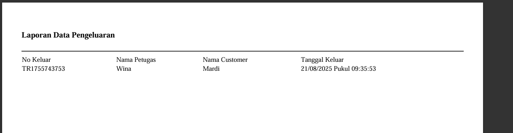

# SISTEM MANAJEMEN GUDANG VADHANA

Sistem ini merupakan aplikasi manajemen gudang sederhana yang dibangun menggunakan **CodeIgniter 3**, **MySQL** sebagai database, dan **AdminLTE 2.3.11** sebagai template tampilan. Aplikasi ini mendukung pengelolaan data barang, transaksi barang masuk/keluar, serta pembuatan laporan.

## 🛠️ Petunjuk Instalasi & Setup


1. **Download Aplikasi**
   - Unduh seluruh folder proyek.

2. **Letakkan pada Folder Web Server**
   - Pindahkan folder proyek ke direktori web server Anda (misal `htdocs` pada XAMPP).

3. **Setup Database**
   - Buat database baru.
   - Import file `db_inventori.sql` ke database yang telah dibuat.

4. **Akses Aplikasi**
   - Buka browser dan akses aplikasi melalui URL:
     ```
     http://localhost/inventori
     ```


## 📂 Struktur Proyek

Berikut struktur folder utama proyek **Sistem Manajemen Gudang Sederhana**:
INVENTORI_PROJECT/
- application/ # Folder utama CodeIgniter: controllers, models, views, config
-  sb-admin/ # Template AdminLTE / custom admin panel
- system/ # Core CodeIgniter
-  vendor/ # Library eksternal (Composer)
- .editorconfig # Konfigurasi editor
- .gitignore # File untuk Git ignore
- .htaccess # File konfigurasi Apache
-  composer.json # Konfigurasi Composer
-  composer.lock # Lock file Composer
- contributing.md # Panduan kontribusi (opsional)
- db_inventori.sql # File database untuk import MySQL
- index.php # Entry point aplikasi
-  license.txt # File lisensi (opsional)
- README.md # Dokumentasi proyek

### 14. DESAIN ERD SEDERHANA


## ⚙️ Fitur Utama

1. **Dashboard**
   - Ringkasan jumlah barang, petugas, transaksi penerimaan, dan pengeluaran.
   - Profil perusahaan.
   - Informasi user yang sedang login.

2. **Manajemen Barang**
   - Tambah, ubah, hapus, dan lihat data barang.
   - Barang memiliki stok yang otomatis berubah sesuai transaksi.

3. **Customer**
   - CRUD data customer (pelanggan).

4. **Supplier**
   - CRUD data supplier.

5. **Petugas**
   - CRUD data petugas (pegawai gudang).

6. **Transaksi**
   - **Transaksi Penerimaan** → barang masuk menambah stok.
   - **Transaksi Pengeluaran** → barang keluar mengurangi stok.

7. **Manajemen Pengguna**
   - Tambah, ubah, hapus akun pengguna.
   - Mendukung role (admin, petugas).

8. **Profil Perusahaan**
   - Data toko/perusahaan seperti nama, email, no telepon, alamat.

---

## ⚠️ Tantangan & Penyelesaian

Sebagai pemula dalam **CodeIgniter**, beberapa kendala yang dihadapi antara lain:

### 1. Koneksi Controller, Model, dan View
- Sulit memahami alur **MVC**.
- Data tidak muncul atau terjadi error saat memanggil model.

### 2. Integrasi AdminLTE
- Menyesuaikan template agar asset **CSS/JS** tampil dengan benar.

### 3. Query Database
- Terjadi error saat menulis query, sehingga update stok gagal.

### Cara Penyelesaian
- Memperdalam dokumentasi **CodeIgniter** dan tutorial **MVC**.
- Melakukan debug data menggunakan `print_r()` dan `var_dump()`.
- Menyesuaikan **path asset** AdminLTE agar tampil dengan benar.
- Belajar menulis query database secara bertahap, mulai dari **SELECT** sederhana hingga **JOIN** kompleks.


## Screenshots UI
### 1. Halaman Login (username:wina111 dan password:11102003)


### 2. Halaman Dashboard


### 3. Halaman Data Barang


### 4. Halaman Tambah Data Barang


### 5. Halaman Edit Data Barang


### 6. Halaman Laporan Data Barang


### 7. Halaman Data Customer


### 8. Halaman Data Supplier


### 9. Halaman Data Petugas


### 10. Halaman Transaksi Penerimaan


### 11. Halaman Tambah Transaksi Penerimaan


### 12. Halaman Transaksi Pengeluaran


### 13. Halaman Tambah Transaksi Pengeluaran


### 14. Halaman laporan Transaksi Penerimaan


### 14. Halaman laporan Transaksi Pengeluaran

